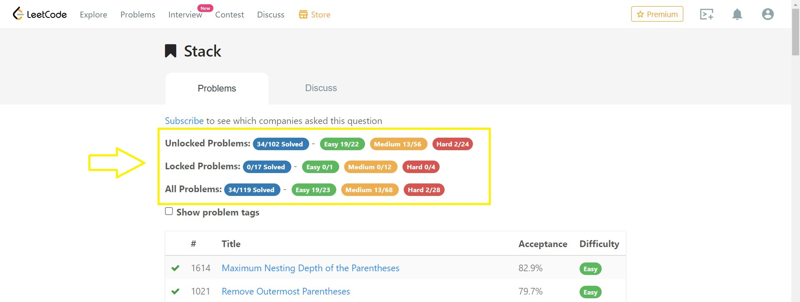

# leetcode-ac-count

<p align="center">
  

A web extension which displays *solved count for each difficutly of any tag in leetcode.com*



## Installation

### Install from source
```bash
cd preferred_directory
git clone <repo_name>
```

### Install on Google Chrome
1. On the search bar, enter **chrome://extensions/**
2. Click on **Load Unpacked**
3. Go to *preferred_directory*
4. Click on **Select Folder**
5. Enable the extension

### Install on Mozilla Firefox
1. On the search bar, enter **about:debugging#/runtime/this-firefox**
2. Click on **Load Temporary Add-on..**
3. Go to *preferred_directory*
4. Click on **any file inside** *preferred_directory*
5. Click on **Open**

## Usage
1. Click on any problem tag in leetcode.com/problemset/all
2. After the tag's page(for example: leetcode.com/tag/stack) loads, the solved count status will be displayed within 10 seconds.

> ***NOTE***: Updates will be visible only after refreshing the page.

**Development Environment:** 
Windows 11 with WSL 1.0

**Build Script:** npm run start

